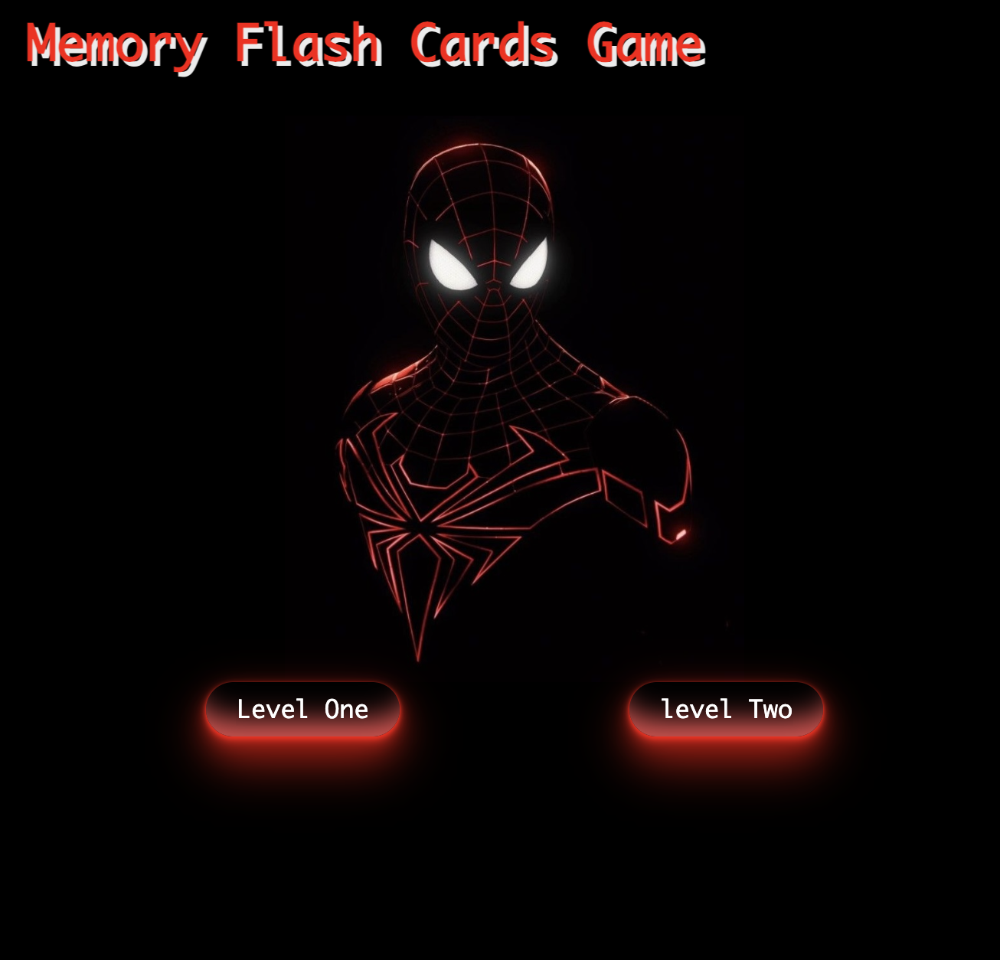

# Memory Flash Cards
## Date 5/2/2024
### By: Fatema Alajmi

[GitHub](https://github.com/fatemaajmi)|[LinkedIn](https://www.linkedin.com/in/fatema-alajmi-0338b0290?utm_source=share&utm_campaign=share_via&utm_content=profile&utm_medium=ios_app)

***
### *Description*
#### The game consists of an even number of tiles with images on one side and a generic back. Each image appears on precisely two tiles. When the game starts, all tiles are turned face down. The player then flips over two cards, selecting them by clicking on them.You will win if you finish all identical images.

### ***Technologies Used***
* HTML
* JavaScript
* CSS
***

### ***Screenshots***

##### image header 1
![start page]

##### image header 2

***

### ***Future Updates***

- [ ] Future Update 1
- [ ] Future Update 2
- [x] Completed Update
- [x] ~~Strikethrough~~ Items Also
